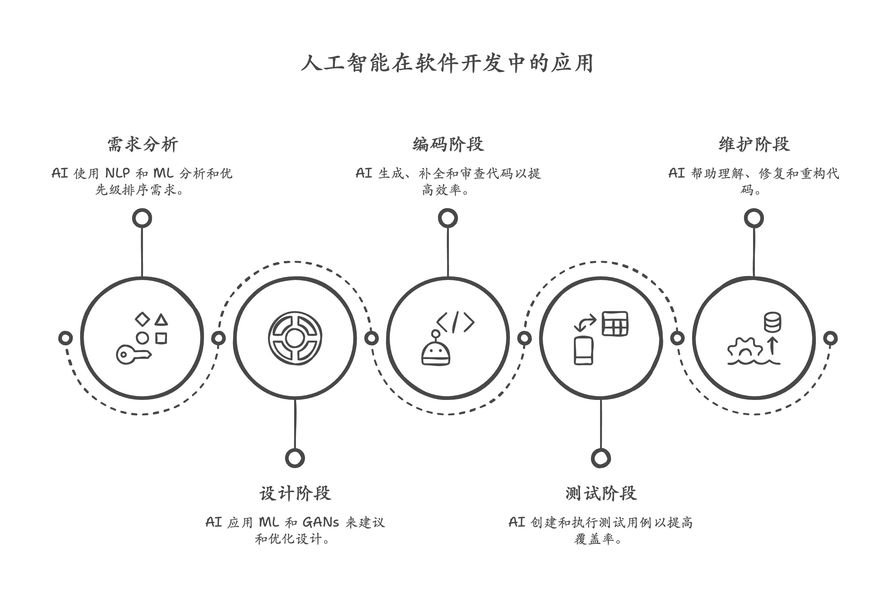

    

[🇨🇳 中文](docs/zh-CN/README.md) | [🇺🇸 English](docs/en/README.md)

# Awesome AI SDLC

版本: v0.0.3

## 项目描述

本项目收集整理人工智能辅助软件开发生命周期(SDLC)的最佳实践、工具链和工作流程。旨在为AI项目开发者提供全面的资源列表。

## 目录

- [概念与理论](#概念与理论)
- [工具与平台](#工具与平台)
- [实践案例](#实践案例)
- [社区与论坛](#社区与论坛)
- [未来趋势](#未来趋势)

## 资源分类

### 概念与理论

1. **AI 在软件开发中的应用 (AI in Software Development)**

   - 概述AI如何应用于SDLC各个阶段的基础理论和实践方法
   - 包括需求分析、设计、编码、测试和维护等环节的AI辅助技术

     

     |                                          文章名称                                          | 链接                                                                                                                    | 推荐理由                                                                                                                                                                                                                                                     |
     | :-------------------------------------------------------------------------------------------: | ------------------------------------------------------------------------------------------------------------------------- | -------------------------------------------------------------------------------------------------------------------------------------------------------------------------------------------------------------------------------------------------------------- |
     |  A Survey on Using Artificial Intelligence Techniques in the Software Development Process  | [链接](https://www.ijera.com/papers/Vol4_issue12/Part%20-%206/D0412062433.pdf)                                          | 基于**全面而宏观的视角** ，了解AI在软件开发领域的整体应用情况，识别**关键趋势和挑战** 。对于希望入门或深入了解该领域的从业者和研究人员来说，这是一份很有价值的**导航图** 。                                                                                  |
     |                      Using AI for requirements analysis: A case study                      | [链接](https://www.thoughtworks.com/en-gb/insights/blog/generative-ai/using-ai-requirements-analysis-case-studyhttps:/) | 通过**实际案例** 展示了生成式AI在需求分析中的应用，为读者提供了**可操作的实践经验** 。它聚焦于软件开发的关键环节，揭示了AI如何**提升需求质量和效率** 。作为知名机构Thoughtworks的分享，内容具有**专业性和参考价值** ，有助于了解AI在软件开发领域的最新实践。 |
     |                        Design in the Age of Artificial Intelligence                        | [链接](https://www.hks.harvard.edu/sites/default/files/centers/mrcbg/Final_AWP_244.pdf)                                 | 这篇哈佛肯尼迪学院的文献综述**全面梳理** 了人工智能对未来工作的影响。它**整合了现有研究** ，帮助读者快速了解该领域的**核心议题、主要观点和研究进展** 。对于希望深入理解AI如何重塑劳动力市场、政策制定者及研究人员而言，这是一份**权威且精炼** 的参考资料     |
     | Comparative Study of AI Code Generation Tools: Quality Assessment and Performance Analysis | [链接](https://dialnet.unirioja.es/descarga/articulo/9873203.pdf)                                                       | 这篇西班牙语文章综述了人工智能在软件开发领域的**现状与趋势** 。它提供了该领域**技术发展和未来方向** 的概览，对于希望了解AI在软件开发中应用的**最新进展和前沿研究** 的读者很有价值。通过西班牙语文献，也能拓展获取**不同语言视角** 的信息。                   |
     | The use of artificial intelligence for automatic analysis and reporting of software defects | [链接](https://www.frontiersin.org/journals/artificial-intelligence/articles/10.3389/frai.2024.1443956/pdf)             | 关于**AI驱动的软件缺陷预测** 的系统性文献综述。它深入探讨了利用人工智能技术来**预测和发现软件缺陷** 的各种方法和研究进展。对于关注**提升软件质量、降低开发成本** 的从业者和研究人员来说，这是一份**系统且深入** 的参考资料                                   |
     |                       Artificial Intelligence In Software Maintenance                       | [链接](https://lutpub.lut.fi/bitstream/handle/10024/163419/Thesis_OulaRantanen.pdf?sequence=1)                          | 这篇芬兰LUT大学的硕士论文深入探讨了**人工智能在软件测试中的应用** 。它可能涵盖了AI在测试自动化、测试用例生成、缺陷检测和分析等方面的理论与实践。作为一篇学位论文，它通常包含**更详尽的研究和分析** ，适合希望深入了解AI如何变革软件测试的读者                |
2. **AI 辅助的软件开发生命周期 (AI-assisted Software Development Lifecycle)**

   - 探讨AI如何增强整个SDLC流程的效率和准确性
   - 涵盖从项目规划到部署运维的全生命周期AI应用
3. **机器学习在软件开发中的应用 (Machine Learning for Software Development)**

   - 机器学习技术在代码生成、缺陷检测和性能优化中的应用
   - 监督学习、无监督学习和强化学习在SDLC中的具体案例
4. **生成式 AI (Gen AI) 和大型语言模型 (LLMs) 在 SDLC 中的作用**

   - 生成式AI在需求文档编写、代码自动生成和测试用例创建中的应用
   - LLMs如何提升开发者的生产力和代码质量

### 工具与平台

本部分列出了利用人工智能技术来辅助软件开发生命周期各个阶段的工具和平台。这些工具旨在提高开发效率、提升软件质量，并降低开发门槛。

#### 代码生成工具

#### 智能测试工具

| 工具名称                                                                                                                    | 核心价值                                                                                                                                                                                                              |
| ----------------------------------------------------------------------------------------------------------------------------- | ----------------------------------------------------------------------------------------------------------------------------------------------------------------------------------------------------------------------- |
| [GitHub Copilot code review](https://docs.github.com/en/copilot/using-github-copilot/code-review/using-copilot-code-review) | - 提高代码质量：早期识别代码缺陷和安全漏洞 - 开发效率提升：自动化审查节省30%人工耗时 - 技能培养机制：实时反馈促进编码规范掌握 - 审查客观性：AI算法消除人为认知偏差 - 流程集成度：无缝对接GitHub开发工作流 |

#### 需求管理工具

#### AI 辅助设计工具

#### DevOps 和部署工具

#### 综合 AI 开发平台

### 实践案例

### 社区与论坛

### 未来趋势

## 贡献指南

请参阅[CONTRIBUTING.md](CONTRIBUTING.md)了解如何参与贡献。

## 行为准则

参与前请阅读我们的[CODE_OF_CONDUCT.md](CODE_OF_CONDUCT.md)。

## 贡献者

- 🤖 AI生成内容 (Trae AI)
- 🧑‍💻 人工贡献

## 协作方式

本项目采用人机协作的创新模式：

1. 内容创作：Trae AI根据人工输入生成初稿
2. 审核：人工贡献者审核并优化内容
3. 翻译：Trae AI完成文档的多语言互译
4. 维护：人工贡献者管理项目并精选内容

## License

This work is licensed under the [Apache License 2.0](LICENSE).
